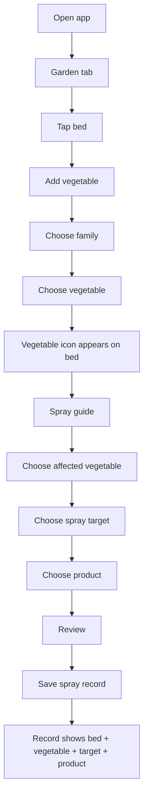
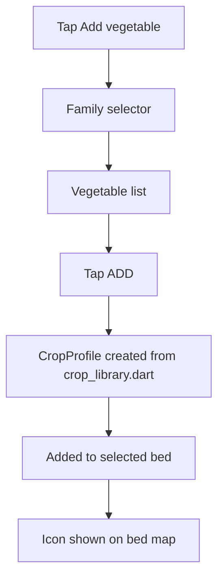
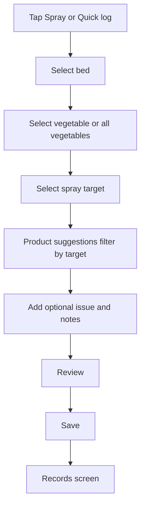
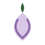

# Spray Tracker — Visual App Flow

This document tracks the current app flow and the crop icons used in the Garden selector and bed map.

## Main Navigation


## Core User Flow



## Add Vegetable Flow



## Spray Logging Flow



## Spray Targets

| Target | Marker | Meaning |
|---|---:|---|
| Pest pressure | `P` | Visible insects, mites, chewing damage, webbing, sticky residue |
| Fungal pressure | `F` | Leaf spots, mildew, rust, blight risk, humid disease weather |
| Preventative | `PR` | No outbreak yet; risk reduction before pressure builds |
| Maintenance | `M` | Plant support, stress recovery, pruning, airflow, crop care |

## Current Icon Assets

These are the current icons used by the app. Some vegetable families still share placeholder icons until custom individual icons are created.

| Icon | Asset | Current use |
|---|---|---|
|  | `assets/veg_icons/tomato.svg` | Tomato, capsicum, chilli, eggplant, Nightshades placeholder |
|  | `assets/veg_icons/leafy.svg` | Brassicas, leafy greens, legumes, herbs placeholder |
|  | `assets/veg_icons/onion.svg` | Onion, garlic, leek, alliums |
|  | `assets/veg_icons/root.svg` | Root vegetables, cucurbits, sweetcorn, specialty placeholder |
|  | `assets/veg_icons/berry.svg` | Berries |

## Garden Bed Icon Sizes

| Location | Size |
|---|---:|
| Bed map icon ribbon | `22 x 22` |
| Selected bed chips | `18 x 18` |
| Add vegetable family card | `28 x 28` |
| Add vegetable card | `34 x 34` |
| Spray guide crop selector | `20 x 20` |
| Spray pressure cards | `28 x 28` |

## Current Family Selector Flow


## Current Crop Families

| Family | Description | Current icon |
|---|---|---|
| Nightshades | Tomatoes, capsicums, chillies, eggplants, potatoes |  |
| Brassicas | Broccoli, cauliflower, cabbage, kale, bok choy, rocket |  |
| Alliums | Onion, garlic, leek, spring onion, chives |  |
| Cucurbits | Cucumber, zucchini, pumpkin, squash, melons |  |
| Legumes | Peas, beans, runner beans, broad beans |  |
| Leafy Greens | Lettuce, spinach, silverbeet, endive, chicory |  |
| Root Vegetables | Carrot, beetroot, radish, parsnip, turnip, swede |  |
| Apiaceae | Celery, parsley, coriander, dill, fennel |  |
| Sweetcorn | Sweetcorn and popcorn corn |  |
| Specialty | Asparagus, okra, kumara, specialty crops |  |
| Berries | Strawberries, raspberries, blueberries |  |

## Orchard, Bush, Herb, Flower Expansion

This is the next crop expansion set for garden items similar to what seed catalogues commonly include: orchard plants, berry bushes, herbs, flowers, pollinator plants, and companion plants.

### Proposed new family cards

| New family | Examples | Icon direction |
|---|---|---|
| Fruit Trees | Apple, pear, peach, plum, apricot, cherry | Rounded tree canopy with small fruit dots |
| Citrus Trees | Lemon, lime, orange, mandarin | Glossy green tree with orange/yellow fruit |
| Nut Trees | Hazelnut, almond, walnut, chestnut | Tree canopy with nut cluster |
| Berry Bushes | Raspberry, blueberry, currant, gooseberry, blackberry | Compact bush with berry clusters |
| Fruit Vines | Grape, kiwifruit, passionfruit | Twining vine with fruit cluster |
| Culinary Herbs | Basil, parsley, coriander, dill, chives, oregano | Herb leaf bunch in a small bundle |
| Medicinal / Tea Herbs | Chamomile, mint, lemon balm, echinacea | Soft herb bundle with flower detail |
| Flowers | Sunflower, calendula, nasturtium, zinnia, cosmos | Bright flower head silhouette |
| Pollinator Plants | Borage, phacelia, alyssum, lavender | Bee-friendly flower cluster |
| Companion Plants | Marigold, nasturtium, basil, dill, calendula | Mixed companion bouquet |
| Native / Shelter Plants | Flax, manuka, kanuka, coprosma | Native leaf/flax silhouette |
| Green Manure / Cover Crops | Lupin, mustard, oats, buckwheat, clover | Ground-cover clump with seed heads |

### Proposed individual icons

```text
fruit_tree.svg
citrus_tree.svg
nut_tree.svg
berry_bush.svg
fruit_vine.svg
herb_basil.svg
herb_mint.svg
herb_parsley.svg
herb_coriander.svg
herb_dill.svg
herb_chives.svg
flower_sunflower.svg
flower_calendula.svg
flower_nasturtium.svg
flower_lavender.svg
flower_borage.svg
companion_marigold.svg
cover_crop_clover.svg
cover_crop_lupin.svg
native_flax.svg
```

## Current Asset Write Status

The concept image sheet has been generated in chat, but it is not yet usable by Flutter as individual transparent app assets. The app needs separate asset files per icon, preferably SVG or transparent PNG.

Current blocker: direct SVG file upload through the connected GitHub write tool failed during this pass. The safe next route is to add the icons from the local project folder with PowerShell or Git, then commit them from the PC.

## Next Icon Work

Replace placeholder/shared icons with individual animated-style SVGs:

```text
tomato.svg
capsicum.svg
chilli.svg
eggplant.svg
potato.svg
broccoli.svg
cauliflower.svg
cabbage.svg
kale.svg
bok_choy.svg
onion.svg
garlic.svg
leek.svg
cucumber.svg
zucchini.svg
pumpkin.svg
pea.svg
bean.svg
lettuce.svg
spinach.svg
silverbeet.svg
carrot.svg
beetroot.svg
radish.svg
corn.svg
asparagus.svg
kumara.svg
strawberry.svg
raspberry.svg
blueberry.svg
fruit_tree.svg
citrus_tree.svg
berry_bush.svg
fruit_vine.svg
herb_basil.svg
flower_sunflower.svg
flower_lavender.svg
cover_crop_clover.svg
native_flax.svg
```

## Design Direction

- Animated/cartoon style, not realistic.
- No background.
- Transparent SVG or PNG.
- Must read clearly at `22 x 22` on garden beds.
- More detailed versions can be used at `34 x 34` in selector cards.
- Each family should have distinct silhouettes so the map is readable at a glance.
